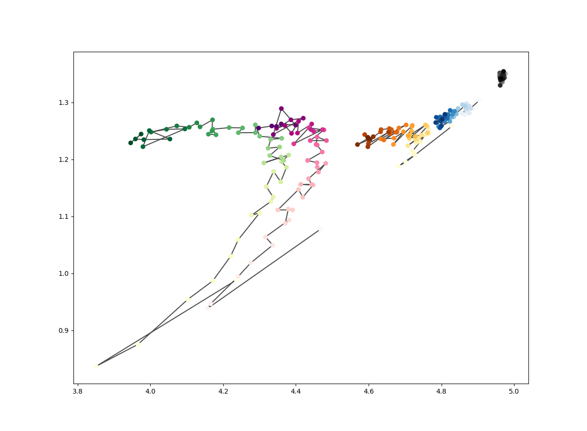

# Tensorflow playground
Just a playground.

Full of happiness (?)

## MLP Mutual Information

A naive Representation of paper _Opening the Black Box of Deep Neural Networks via Information_.  
(SimpleMLP_wMICalc_DataGen.py)

MLP: 12 (Input) - 12 - 10 - 8 - 6 - 5 - 4 (Output)  
Batchsize: 150  
Learning rate: 0.1 (fixed)  
Data set size: 300000  
Learning Loops: 20 (50 in original paper)  
Optimizer: SGD (without momentum)

### Results:  
The MI Plane plot (darker = more iteration):
  

Zoom Up:  

**Change the MLP to:** 12 - 10 - 8 - 6 - **6** :  

**Change the MLP to:** 12 - 10 - **6 - 10 - 6** :  

>Ref:

>Shwartz-Ziv, Ravid, and Naftali Tishby. "Opening the Black Box of Deep Neural Networks via Information." arXiv preprint arXiv:1703.00810 (2017).
